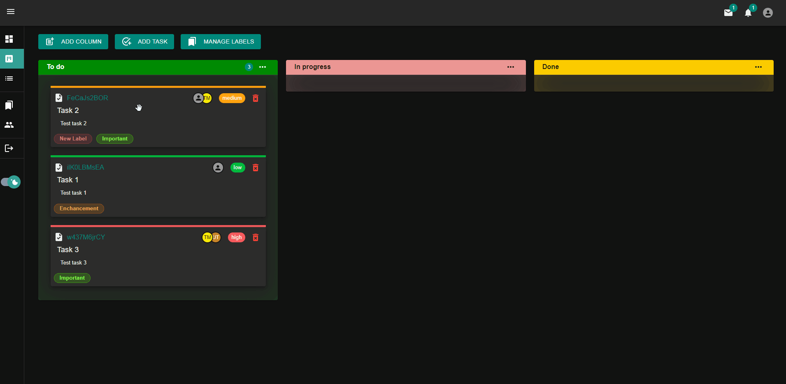

    

#
 

Fullstack app for managing tasks with canban board.

## Demo

Link for live demo: [tasktalk.rbnsnn.com](https://tasktalk.rbnsnn.com)

## Tech Stack

**Client:** React, Redux, MaterialUI, React DnD, 

**Server:** NestJS, MongoDB

## Features

- Acces and refresh token authentication
- RBAC authorization
- Drag and drop task management
- Light/dark mode toggle

## Roadmap

- Dashboard tasks statistics

- Add messaging system

- Task change history

- Notifications

